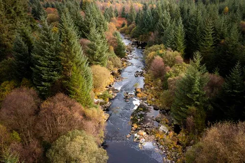
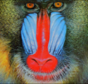
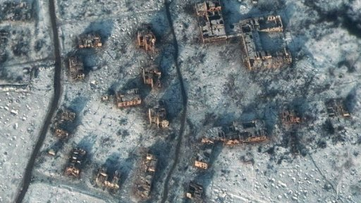
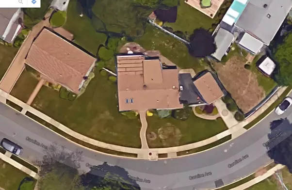

# MAHADEV'S

## Project Name

Satellite Image Resolver

## Tagline

AI-based upscaling techniques for enhancing images and videos, ensuring high-resolution visuals across various fields.

## Problem Solved

Upscaling involves increasing the resolution of an image or video sequence, making it appear larger or sharper. Traditional upscaling methods often result in artifacts and blurriness. This project addresses the need for high-resolution visuals across various fields, including satellite imagery, CCTV, and medical diagnostics, using advanced machine learning algorithms to produce higher-quality results.

## Project Overview

This project aims to enhance images and videos using advanced AI-based upscaling techniques. It leverages state-of-the-art deep learning models like GANs and CNNs to provide high-quality upscaling with enhanced detail and reduced artifacts.

## Features

1. **Image Super Resolution**:

   - Uses ESRGAN for upscaling images, significantly improving their resolution and quality.

2. **Video-Based Enhancement**:

   - Extracts frames from videos using OpenCV.
   - Detects and enhances faces using Retina for face detection, GFPGAN for facial restoration, and CodeFormer for further enhancement.
   - Combines the processed faces back into the original frames to maintain continuity.

3. **Image Format Conversions**:

   - Allows conversion of images between different formats (e.g., PNG to JPEG).

4. **Satellite Image Upscaling (Upcoming)**:

   - Enhances satellite images to provide high-resolution outputs for better analysis and interpretation.

5. **Medical Image Upscaling (Upcoming)**:
   - Upscales medical images like MRI and CT scans, aiding in better diagnosis and analysis.

## OUTPUT

- **IMAGE SUPER RESOLVER (ESRGAN)**

Input
<br>


Output
<br>


# ---------------------------------------------------------------

Input
<br>


Output
<br>


- **SATELLITE IMAGE SUPER RESOLVER (ESRGAN)**

Input
<br>


Output
<br>


# ---------------------------------------------------------------

Input
<br>


Output
<br>


# ---------------------------------------------------------------

## Technologies Used

### Frontend

- **ReactJS**: For building the user interface.
- **Axios**: For API interactions.
- **Tailwind CSS**: For responsive and modern styling.

### Backend

- **Python** and **Flask**: RESTful API development and model integration.
- **Flask-CORS**: For handling cross-origin resource sharing.
- **Logging**: For backend monitoring and debugging.

### Machine Learning Models and Libraries

- **OpenCV**: Frame extraction and image processing.
- **Retina**: Face detection in video frames.
- **GFPGAN** and **CodeFormer**: Advanced facial enhancement.
- **ESRGAN**: High-quality image upscaling.
- **Scikit-Learn**: Preprocessing and auxiliary ML tasks.
- **PyTorch**: Deep learning framework for running models.

### General Tools & Libraries

- **PIL (Pillow)**: For image manipulation.
- **NumPy**: For numerical operations and handling arrays.

## Links

- Frontend(vercel) : [frontend](https://hack-frontend-eta.vercel.app/)
- VIDEO : [MAHADEVs](https://www.canva.com/design/DAGUwLI0hps/HRW6042CKOS12Pi5vkIfBQ/edit?utm_content=DAGUwLI0hps&utm_campaign=designshare&utm_medium=link2&utm_source=sharebutton)

## How It Works

### Workflow

1. **Frame Extraction**: Extract frames from videos using OpenCV.
2. **Face Detection**: Use Retina to detect faces in the extracted frames.
3. **Preprocessing**: Align and normalize detected faces for consistency.
4. **Facial Enhancement**: Enhance facial details using CodeFormer and GFPGAN.
5. **Feature Reconstruction**: Improve image clarity using ESRGAN.
6. **Post-Processing**: Recombine enhanced faces with the original frames and apply additional refinement techniques.

## Getting Started

### Prerequisites

- **Node.js**: For running the frontend.
- **Python 3.x**: For the backend server and models.
- **CUDA**: (Optional) For GPU acceleration with PyTorch.

### Installation

1. Clone the repository:

   ```bash
   git clone https://github.com/your-repo.git
   cd your-repo

   ```

2. Backend Setup:

- Navigate to the backend directory:

  ```
  cd backend
  ```

- Create a virtual environment and activate it:
  ```
  python -m venv venv
  source venv/bin/activate  # On Windows: venv\Scripts\activate
  ```
- Install dependencies:

  ```
  pip install -r requirements.txt
  ```

- Run the Flask server:
  ```
  python app.py
  ```

<br>

3. Frontend Setup:

- Navigate to the frontend directory:

  ```
  cd frontend
  ```

- Install dependencies:

  ```
  npm install
  ```

- Start the React app(vite):
  ```
  npm run dev
  ```

## Acknowledgments

- **Xinntao/ESRGAN** : For providing the ESRGAN model used for image upscaling.
  <br>
- **RetinaFace** : For robust face detection.
  <br>
- **GFPGAN and CodeFormer** : For state-of-the-art facial enhancement.

- API's : [ConvertApi](https://www.convertapi.com/)
  - used for converting jpg -> png & png -> jpg

<br>
- **Hackathon team** : Darshan Kakad, Ayush Duseja, Soham Chaudhari, Pranita Bannore.
